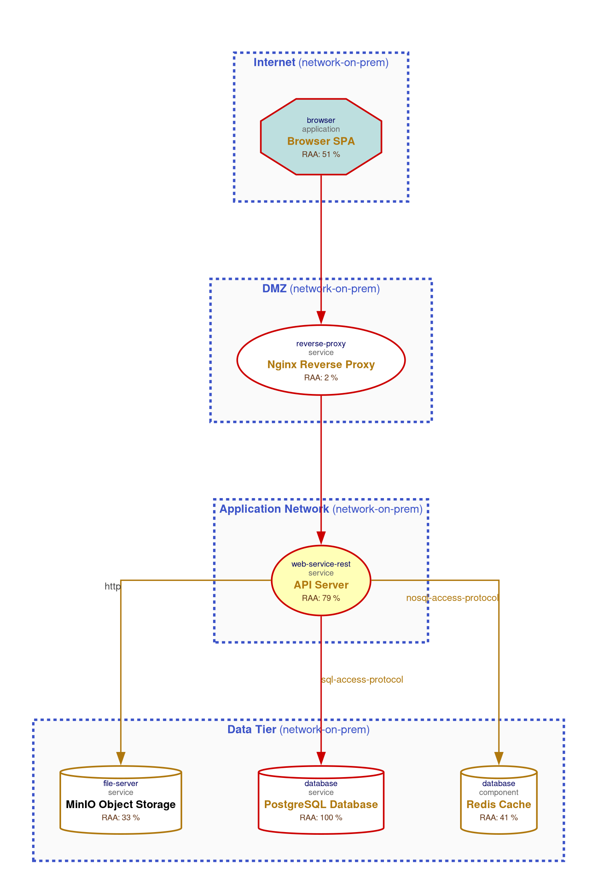

= Data-Flow Diagram

The following diagram was generated by Threagile based on the model input and gives a high-level overview of the data-flow
between technical assets. The RAA value is the calculated _Relative Attacker Attractiveness_ in percent.
For a full high-resolution version of this diagram please refer to the PNG image file alongside this report.
	

