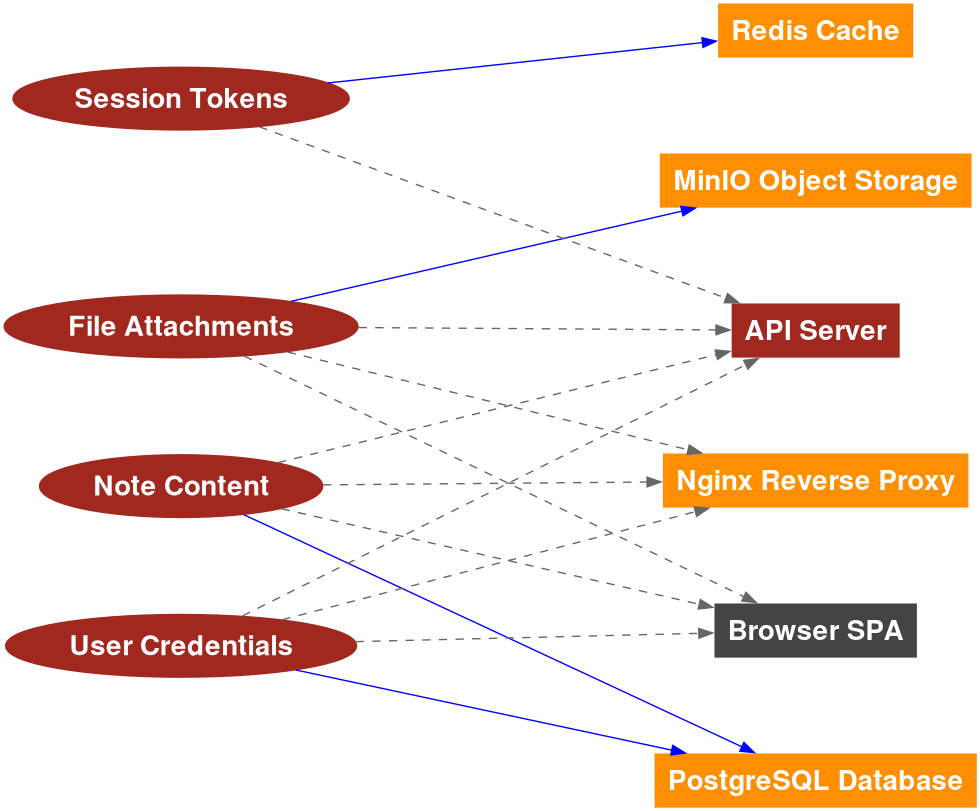

= Data Mapping

The following diagram was generated by Threagile based on the model input and gives a high-level distribution of
data assets across technical assets. The color matches the identified data breach probability and risk level (see
the "Data Breach Probabilities" chapter for more details). A solid line stands for _data is stored by the asset_
and a dashed one means _data is processed by the asset_. For a full high-resolution version of this diagram please
refer to the PNG image file alongside this report.

