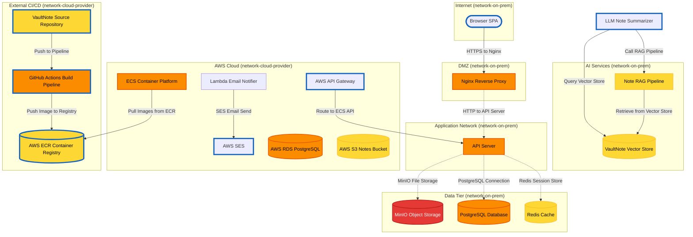

```mermaid
flowchart TB
  subgraph tb_ai_services["AI Services (network-on-prem)"]
    n_rag_pipeline["Note RAG Pipeline"]
    n_vector_store[("VaultNote Vector Store")]
  end
  subgraph tb_application_network["Application Network (network-on-prem)"]
    n_api_server["API Server"]
  end
  subgraph tb_aws_cloud["AWS Cloud (network-cloud-provider)"]
    n_aws_api_gateway["AWS API Gateway"]
    n_aws_ses["AWS SES"]
    n_ecs_platform["ECS Container Platform"]
    n_lambda_notifier["Lambda Email Notifier"]
    n_rds_postgresql[("AWS RDS PostgreSQL")]
    n_s3_notes_bucket[("AWS S3 Notes Bucket")]
  end
  subgraph tb_data_tier["Data Tier (network-on-prem)"]
    n_minio_storage[("MinIO Object Storage")]
    n_postgresql_db[("PostgreSQL Database")]
    n_redis_cache[("Redis Cache")]
  end
  subgraph tb_dmz["DMZ (network-on-prem)"]
    n_nginx_proxy["Nginx Reverse Proxy"]
  end
  subgraph tb_external_cicd["External CI/CD (network-cloud-provider)"]
    n_build_pipeline["GitHub Actions Build Pipeline"]
    n_container_registry[("AWS ECR Container Registry")]
    n_source_repo["VaultNote Source Repository"]
  end
  subgraph tb_internet["Internet (network-on-prem)"]
    n_browser_spa(["Browser SPA"])
  end
  %% assets outside any trust boundary
  n_llm_summarizer["LLM Note Summarizer"]
  %% communication links (solid = encrypted/VPN, dashed = cleartext)
  n_api_server -.->|MinIO File Storage| n_minio_storage
  n_api_server -.->|PostgreSQL Connection| n_postgresql_db
  n_api_server -.->|Redis Session Store| n_redis_cache
  n_aws_api_gateway -->|Route to ECS API| n_api_server
  n_browser_spa -->|HTTPS to Nginx| n_nginx_proxy
  n_build_pipeline -->|Push Image to Registry| n_container_registry
  n_ecs_platform -->|Pull Images from ECR| n_container_registry
  n_lambda_notifier -->|SES Email Send| n_aws_ses
  n_llm_summarizer -->|Call RAG Pipeline| n_rag_pipeline
  n_llm_summarizer -->|Query Vector Store| n_vector_store
  n_nginx_proxy -.->|HTTP to API Server| n_api_server
  n_rag_pipeline -->|Retrieve from Vector Store| n_vector_store
  n_source_repo -->|Push to Pipeline| n_build_pipeline
  %% styling
  classDef sevHigh fill:#e53935,color:#ffffff,stroke:#b71c1c,stroke-width:2px;
  classDef sevElevated fill:#fb8c00,color:#000000,stroke:#e65100,stroke-width:2px;
  classDef sevMedium fill:#fdd835,color:#000000,stroke:#f9a825,stroke-width:1px;
  classDef internet stroke:#1565c0,stroke-width:4px;
  class n_api_server sevElevated;
  class n_aws_api_gateway internet;
  class n_aws_ses internet;
  class n_browser_spa internet;
  class n_build_pipeline sevElevated;
  class n_build_pipeline internet;
  class n_container_registry sevMedium;
  class n_container_registry internet;
  class n_ecs_platform sevElevated;
  class n_llm_summarizer internet;
  class n_minio_storage sevHigh;
  class n_nginx_proxy sevElevated;
  class n_postgresql_db sevElevated;
  class n_rag_pipeline sevMedium;
  class n_rds_postgresql sevElevated;
  class n_redis_cache sevMedium;
  class n_s3_notes_bucket sevMedium;
  class n_source_repo sevMedium;
  class n_source_repo internet;
  class n_vector_store sevMedium;
```
